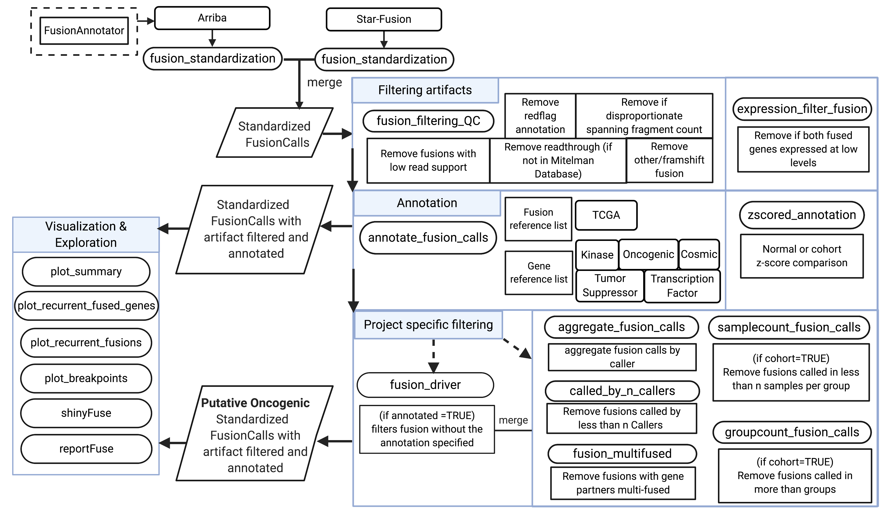

```{r setup, include=FALSE} 
knitr::opts_chunk$set(warning = FALSE, message = FALSE)
```


# Introduction

In this vignette, we demonstrate how to use _annoFuse_ for single samples to filter out fusions known to be artifactual or with low read support as well as retain high-quality fusion calls from STAR-Fusion and Arriba.
We also annotate high quality fusion calls and capture known and putative oncogenic driver fusions previously reported in TCGA or fusions containing gene partners that are known oncogenes, tumor suppressor genes, COSMIC genes, and/or transcription factors.

## Generating StarFusion and arriba files
  * [STAR-Fusion](https://github.com/STAR-Fusion/STAR-Fusion/wiki)
  * [Arriba](https://arriba.readthedocs.io/en/latest/)

## Fusion format requirements

  * [STAR-Fusion star-fusion.fusion_predictions.tsv ](https://github.com/STAR-Fusion/STAR-Fusion/wiki#output-from-star-fusion)
  * [Arriba fusions.tsv](https://arriba.readthedocs.io/en/latest/output-files/)

## Rsem gene format
  * RSEM genes.results.gz

# Overview of the package
Here, we present annoFuse, an R package developed to annotate and retain expressed known and novel gene fusions, while removing artifactual fusions.

 * We used [FusionAnnotator](https://github.com/FusionAnnotator/FusionAnnotator/tree/v0.2.0) to annotate Arriba files to specifically identify “red flag” fusions found in healthy tissues or in gene homology databases, which are then added as the column "annots" to match the annotation in STAR-Fusion calls. 
 Users can add any annotation they deem useful for their dataset to this field and filter using the param `artifactFilter` in `annoFuse_single_sample()`

`annoFuse_single_sample()` runs the following functions for the given sample:
`fusion_standardization` -> `fusion_filtering_QC` -> `expression_filter_fusion` -> `annotate_fusion_calls`. 
Please refer to the filtering criteria available per the function below:



Additionally, in the vignette we annotate filtered fusions with Pfam domains in Gene1A (Gene 5') and Gene1B (Gene 3') by running `get_Pfam_domain()`.
We visualize the breakpoint in _BRAF_ causing the _KIAA1549--BRAF_ fusion in this sample by running `plot_breakpoints()`.


## Single sample Star Fusion and arriba standardization, annotation and filtering.

```{r}
suppressPackageStartupMessages(library("annoFuse"))
suppressPackageStartupMessages(library("dplyr"))
suppressPackageStartupMessages(library("reshape2"))
suppressPackageStartupMessages(library("ggplot2"))

# Run annoFuse for Single sample with default expression filter and FusionAnnotator red flag artifact filter
standardFusioncalls <- annoFuse::annoFuse_single_sample(
  # Example files are provided in extdata, at-least 1 fusionfile is required along with it's rsem expression file
  fusionfileArriba = system.file("extdata", "arriba_example.tsv", package = "annoFuseData"),
  fusionfileStarFusion = system.file("extdata", "starfusion_example.tsv", package = "annoFuseData"),
  expressionFile = system.file("extdata", "example.rsem.genes.results.gz", package = "annoFuseData"),
  tumorID = "BS_W97QQYKQ",
  # multiple read flag values for filtering using FusionAnnotator values
  artifactFilter = "GTEx_Recurrent|DGD_PARALOGS|Normal|BodyMap|ConjoinG",
  # keep all in-frame , frameshift and other types of Fusion_Type
  readingFrameFilter = "in-frame|frameshift|other",
  # keep all fusions with atleast 1 junction read support
  junctionReadCountFilter = 1,
  # keep only fusions where spanningFragCount-junctionReadCountFilter less than equal to 10
  spanningFragCountFilter = 10,
  # keep read throughs
  readthroughFilter = FALSE
)

# Add domain level information for fusion
# read in pfamDataBioMart with pfam and gene boundaries from UCSC pfam and biomaRt package
bioMartDataPfam <- readRDS(system.file("extdata", "pfamDataBioMart.RDS", package = "annoFuseData"))
annDomain <- annoFuse::get_Pfam_domain(
  standardFusioncalls = standardFusioncalls,
  bioMartDataPfam = bioMartDataPfam,
  # partial overlapping domains are retained == "Partial" with keepPartialAnno=TRUE; if keepPartialAnno=FALSE then domain retained status == "No"
  keepPartialAnno = TRUE
)

# read in exonsToPlot with exon and gene boundaries from gencode.v27.primary_assembly.annotation.gtf.gz
exons <- readRDS(system.file("extdata", "exonsToPlot.RDS", package = "annoFuseData"))
```

## Plot breakpoint

```{r , fig.width=10, fig.height=5}
# plot BRAF breakpoint in sample for KIAA1549--BRAF fusion
kiaa1549 <- plot_breakpoints(domainDataFrame = annDomain, exons = exons, geneposition = "Left", fusionname = "KIAA1549--BRAF", base_size = 12)
braf <- plot_breakpoints(domainDataFrame = annDomain, exons = exons, geneposition = "Right", fusionname = "KIAA1549--BRAF", base_size = 12)

ggpubr::ggarrange(kiaa1549, braf, align = "h")
```

# Session info {-}

```{r}
sessionInfo()
```
